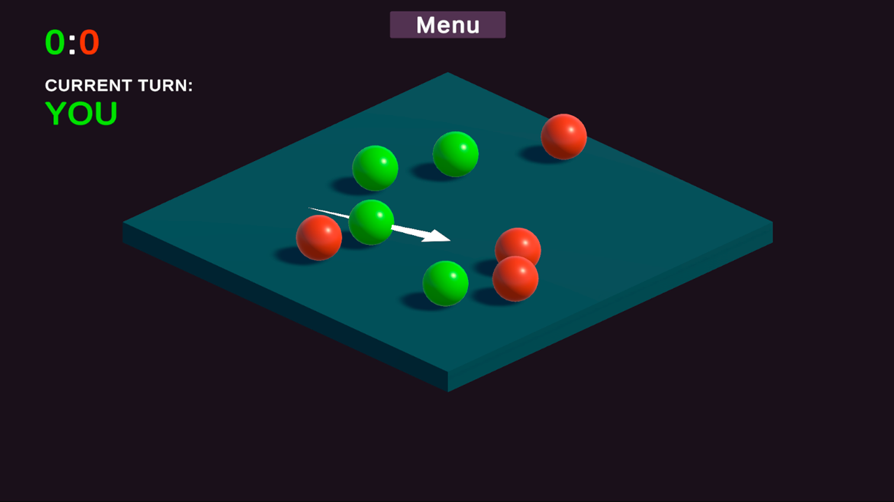
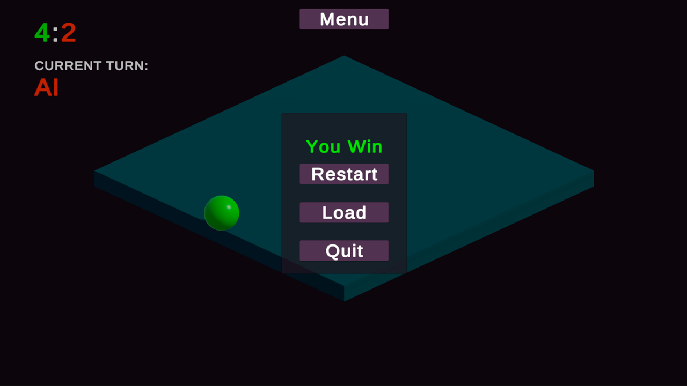
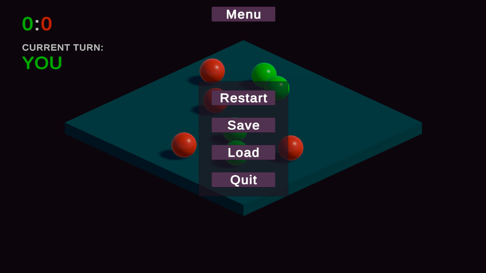

# Unity-ECS-Ball-Smash

**Unity-ECS-Ball-Smash** — это мой первый проект, реализованный с использованием архитектуры Entity Component System (ECS) на базе фреймворка [LeoECS Lite](https://github.com/Leopotam/ecslite).

## О проекте

Это небольшая пошаговая игра, где два игрока (игрок и AI) управляют шарами на платформе. Цель — столкнуть шары противника за пределы платформы. Шар запускается в направлении, противоположном натяжению, как в рогатке.

Основные особенности:
- Реализация архитектуры ECS через **LeoECS Lite**
- Пошаговая очередь ходов: игрок и AI
- Сохранение и загрузка состояния
- Система визуальной натяжки и UI
- Простая, но модульная архитектура

## Используемые технологии

- Unity 2022+
- LeoECS Lite
- C#
- uGUI

## Скриншоты

## Статус

Проект находится в процессе доработки. Основной фокус — освоение ECS.